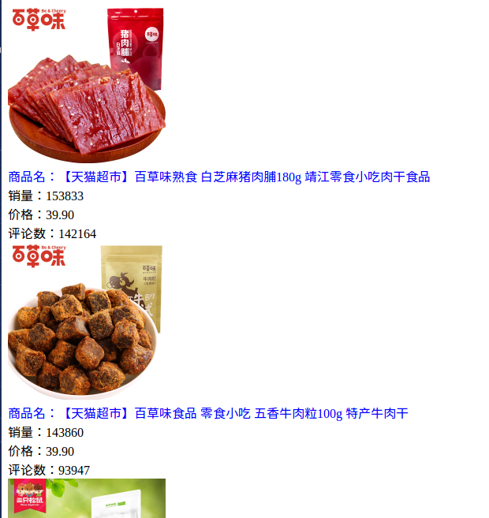

# 程序的目的
本程序是写来参加牛客网的[【编程之美02期】如何给女朋友买到心仪的零食](http://www.nowcoder.com/discuss/18223?type=0&order=0&pos=3&page=1)，题目是：
> 用你的代码，来爬取天猫或者京东或者任一电商网站上购买率比较高的零食，来拯救你双十一！可以是淘宝关键字中有女朋友字样的零食，也可以是直接看购买率比较高的零食，亦或是你通过什么途径来获取！
总之！真正锻炼动手能力才是真！


# 结果预览
我把结果输出成为html了，这样比较美观：



# 解决问题
本程序用来对淘宝的零食进行简单的单页面爬取（单个页面上的零食已经够吃了，再不够加多一个url就搞定，反正都是模块化的）。
想分享的主要是解决的思路！


## 爬取不到淘宝页面？
一开始爬取页面的时候，我用的是最平常的html爬取，但是发现用相应的html正则表达式，居然匹配不到内容？？？
反复确认了几次，正则表达式没写错，然后就看了爬下来的页面内容，发现不是最终的html内容，它把商品信息放到javascript里边去了，google了一下，发现基本所有人都说要么用js解析，要么用淘宝提供的api（好像挺多api需要收费的），坑爹啊，真的做不到了吗？？？


## 一定要用js去解析吗？
我不想搞那么复杂的东西，比如用pyspider这些自带了解析js的框架，或者浏览器插件等等，花钱去买api就更没劲了～

于是乎，我重新回到用程序获取到的页面内容，分析了一下，发现它其实这个形式更加简单来抓取内容！！！它就是把数据变成纯粹的json数据而已！！！如下所示。


```json
{"i2iTags":{"samestyle":{"url":"/search?type\u003dsamestyle\u0026app\u003di2i\u0026rec_type\u003d1\u0026uniqpid\u003d-165811852\u0026nid\u003d520113726631"},"similar":{"url":"/search?type\u003dsimilar\u0026app\u003di2i\u0026rec_type\u003d1\u0026uniqpid\u003d-165811852\u0026nid\u003d520113726631"}},"p4pTags":[],"nid":"520113726631","category":"50009866","pid":"-165811852","title":"【三只松鼠_猪肉猪肉脯210g】休闲食品小吃\u003cspan class\u003dH\u003e零食\u003c/span\u003e靖江特产猪肉干","raw_title":"【三只松鼠_猪肉猪肉脯210g】休闲食品小吃零食靖江特产猪肉干","pic_url":"//g-search2.alicdn.com/img/bao/uploaded/i4/i2/TB1bTo6KpXXXXb5XVXXXXXXXXXX_!!0-item_pic.jpg","detail_url":"//detail.tmall.com/item.htm?id\u003d520113726631\u0026ns\u003d1\u0026abbucket\u003d0","view_price":"19.90","view_fee":"0.00","item_loc":"安徽 芜湖","reserve_price":"40.00","view_sales":"137017人付款","comment_count":"502145","user_id":"880734502","nick":"三只松鼠旗舰店","shopcard":{"levelClasses":[{"levelClass":"icon-supple-level-jinguan"},{"levelClass":"icon-supple-level-jinguan"},{"levelClass":"icon-supple-level-jinguan"},{"levelClass":"icon-supple-level-jinguan"},{"levelClass":"icon-supple-level-jinguan"}],"isTmall":true,"delivery":[484,1,1637],"description":[491,1,3066],"service":[486,1,1630],"encryptedUserId":"UOmgWMGv0MFNy","sellerCredit":20,"totalRate":10000},"icon":[{"title":"双十一商品","dom_class":"icon-fest-shuangshiyi","position":"1","show_type":"0","icon_category":"baobei","outer_text":"0","html":"","icon_key":"icon-fest-shuangshiyi","trace":"srpservice","traceIdx":6,"innerText":"双十一商品"},{"title":"双11购物券","dom_class":"icon-fest-shuangshiyigouwuquan","position":"1","show_type":"0","icon_category":"baobei","outer_text":"0","html":"","icon_key":"icon-fest-shuangshiyigouwuquan","trace":"srpservice","traceIdx":7,"innerText":"双11购物券"},{"title":"度量单位","dom_class":"icon-service-duliangheng","position":"1","show_type":"0","icon_category":"cat_special","outer_text":"0","html":"\u003cspan class\u003d\"icon-pit icon-service-duliang\"\u003e\u003cb\u003e47.38\u003c/b\u003e元/500g\u003c/span\u003e","icon_key":"icon-service-duliangheng","trace":"srpservice","traceIdx":8,"innerText":"度量单位"},{"title":"尚天猫，就购了","dom_class":"icon-service-tianmao","position":"1","show_type":"0","icon_category":"baobei","outer_text":"0","html":"","icon_key":"icon-service-tianmao","trace":"srpservice","traceIdx":9,"innerText":"天猫宝贝","url":"//www.tmall.com/"}],"comment_url":"//detail.tmall.com/item.htm?id\u003d520113726631\u0026ns\u003d1\u0026abbucket\u003d0\u0026on_comment\u003d1","shopLink":"//store.taobao.com/shop/view_shop.htm?user_number_id\u003d880734502","risk":""}
```


所以我只需要简单写正则表达式获取即可！甚至还不需要去解析json～

```python
pattern = '"raw_title":"([^"]*)","pic_url":"([^"]*)","detail_url":"[^"]*","view_price":"([^"]*)","view_fee":"[^"]*","item_loc":"[^"]*","reserve_price":"[^"]*","view_sales":"(\d+)人付款","comment_count":"(\d+)"'
```


## 上述solution的时效性
注意，这个小技巧只是因为淘宝暂时这样做，所以才行得通，如果后续它用别的方法放数据，就得因时制宜了


jacket，
2016年11月4日 09:54于至善园